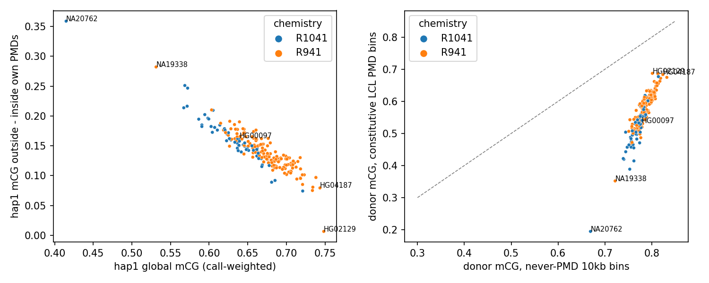
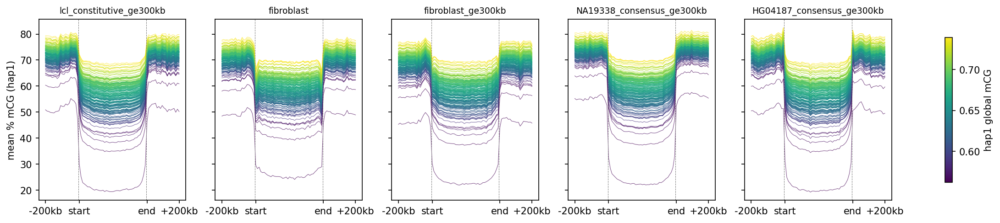
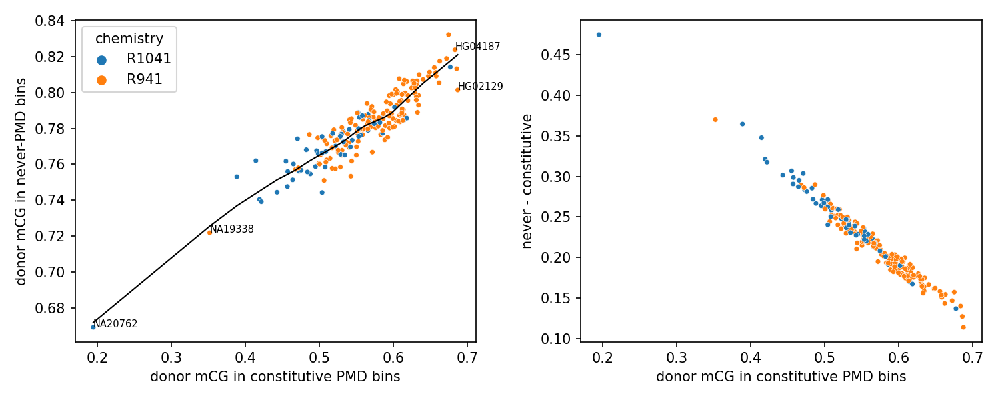
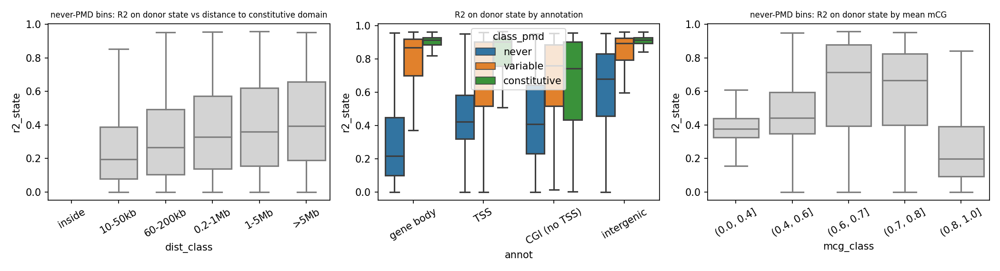
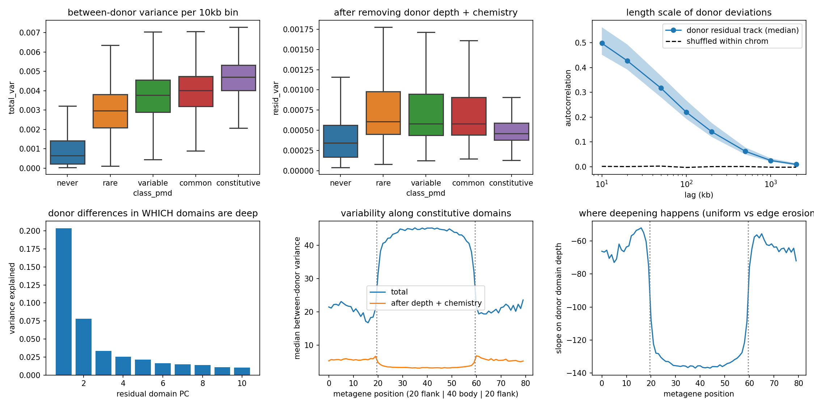
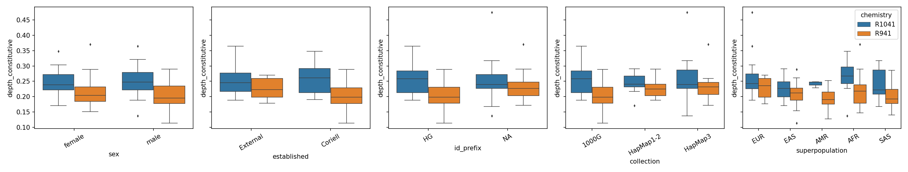
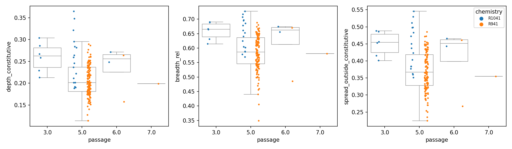
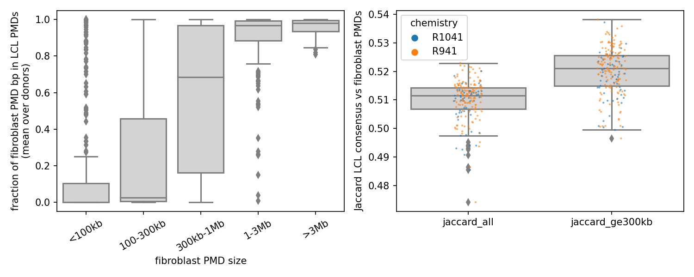

# RESULTS — what we know, and what shows it

Current validated findings only. No history: how each result was arrived at (including analyses
that were retracted along the way) is in `JOURNAL.md`; what has finished running is in
`PROGRESS.md`.

Cohort: HPRC2 lymphoblastoid cell lines, haplotype-resolved ONT methylation.
**202 donors with assemblies, 402 haplotypes, ~30x per CpG per haplotype**, hg38.
Last updated 2026-09-18 (ASM replication audit: §8-10 new).

---

**Two manuscripts.** The PMD/domain findings (§2-5) and the ASM findings (§6-7) are being written
in parallel as separate papers; §1 (resource and its technical limits) is shared by both.

## The questions

1. Is this dataset usable as a population-scale haplotype methylome resource, and what are its
   technical limits?
2. What does variation between LCL methylomes actually look like?
3. What causes it?
4. How do these domains compare to PMDs in another cell type?
5. Is domain state genetic?
6. How much allele-specific methylation is there, and are the calls real?
7. What has to be controlled before ASM can be compared across donors?
8. Which ASM loci replicate across donors, and what distinguishes them?
9. How do the domains relate to the ASM?
10. What actually causes the per-donor inflation?
11. Can penetrance be estimated without throwing away most of the cohort?
12. What sets ASM penetrance, and is any of it ancestry-linked?
13. Is the incomplete penetrance cis and haplotypic?
14. Is ancestry a useful axis for ASM at all?

---

## 1. The resource is usable; the main technical limit is ONT chemistry

**Coverage.** ~30x per CpG per haplotype (mean/median 30.1/30 for NA19338 hap1 over 32.2M
assembly CpGs, 99.93% of them covered); ~35x physical read depth, mean read span 57 kb.

**Coverage is sufficient per haplotype — verified across all 402, not extrapolated.** Mean
per-CpG depth of the methcounts actually fed to `dnmtools pmd`: median **29.7x**, quartiles
27.5–33.3, **min 15.6x, max 41.9x; none below 15x, only 6 haplotypes below 20x**. `dnmtools`
documents ~10x as its recommendation, so every haplotype is ~1.5–4x above it. Coverage barely
predicts the calls (corr with PMD burden +0.09, with domain contrast +0.10).

**Why we call PMDs per haplotype rather than pooling the two into a "diploid" methylome:**
- coverage is not the binding constraint (above), so pooling buys little;
- the haplotypes agree about where domains are (PMD-bin Jaccard 0.91 per donor; mean |hap1−hap2|
  0.026 inside domains vs 0.019 outside), so pooling would not move the map;
- pooling is not free: the two haplotypes are assembled separately, so it requires projecting
  both into a common reference first, and it discards exactly the haplotype resolution the ASM
  arm of the project needs.
**Downsampling proves the point empirically** (A01g, NA19338 + HG00097, both haplotypes; thin the
methcounts and re-call): PMD calls are essentially unchanged down to 10x and degrade only mildly
at 5x.

| depth | Jaccard vs full-depth calls | PMD burden (Gb) |
|---|---|---|
| 20x | 0.97 | 1.54-1.89 |
| 15x | 0.95 | 1.49-1.87 |
| 10x | 0.94-0.95 | 1.55-1.90 |
| 5x | 0.89-0.92 | 1.69-1.86 |

At the cohort's actual depth (median 29.7x, min 15.6x) the calls are saturated, so pooling the two
haplotypes into a diploid methylome would not change the domain map — it would only cost
haplotype resolution.

**Chemistry is the dominant technical covariate and is NOT harmonized.** The modbeds use each
donor's original basecalls: 156 donors R9.4.1/Guppy, 73 R10.4.1/Dorado (HPRC2 Supp S6). Verified
by read ID: NA19338 and HG00099 modbed reads are 6,000/6,000 from their 2022 R9 runs, although
newer R10 data exists for them.

- R10 donors read ~4 points lower in call-weighted global mCG (R² 0.21–0.26); the effect is
  concentrated inside low-methylation domains (in-domain mCG 0.56 vs 0.61).
- It is PC2 of the 10 kb methylation matrix (R² 0.30).
- It does **not** move domain locations: R9-vs-R10 domain-frequency correlation r = 0.994.
- HPRC2 themselves use ONT chemistry as an mQTL covariate but report no effect size.

**Practical rule:** put chemistry in every cross-donor model and replicate headline results
within R9.4.1 alone (n ≈ 150).

Also verified: coverage matches HPRC2's reported values (`figures/qc/coverage_actual_vs_reported.png`),
and the chr1 centromere gap in browser views is an hg38 limitation (modeled satellite / N-gap),
not missing data — the assemblies carry that sequence at normal coverage.

---

## 2. LCL methylomes differ along one continuous axis: how deep their domains are

**PC1 of the 10 kb matrix explains 82% of between-donor variance**, and tracks domain
hypomethylation (PMD burden R² 0.59), not ancestry (0.11).

**The gradient is smooth, not on/off.** Every donor has domains (genome-wide PMD burden
1.10–1.89 Gb, median 1.45; no donor near zero); burden is unimodal; depth is continuous with a
long deep tail.

*Left: each donor's own PMD contrast vs its global mCG — a clean continuum from NA20762 and
NA19338 (deep) to HG04187 and HG02129 (shallow). Right: mCG in constitutive domain bins vs
never-domain bins; all donors sit below the diagonal, i.e. domains are always the lower
compartment, by a donor-specific amount.*

**Domain locations are shared; only depth varies.** 41% of 10 kb bins are domains in ≥90% of
donors; donor-vs-donor PMD overlap is Jaccard 0.87. The deepest donor (NA19338) is an extreme
version of the common methylome, not a different one: 65% of its PMD bins are the constitutive
set. Even the most methylated donors show the same domains, just shallowly.

*Metagene over constitutive domains and fibroblast PMDs (40 scaled body bins, 200 kb flanks).
Every donor has the same domain shape and boundaries; the curves differ almost only in depth.*

**Most between-donor variance lives in domains, and the rest of the genome follows.**
Constitutive-domain bins are 41% of bins but carry 60% of between-donor variance (all domain
classes: 90%); never-domain bins are 31% of bins and 9.7% of variance. Outside-domain mCG rises
linearly with in-domain mCG (slope 0.27, R² 0.84, no curvature), i.e. it moves at about a quarter
of the in-domain rate, with no threshold where it becomes "normal".

Outside domains, the state-linked variation is concentrated in intermediately methylated
intergenic sequence (R²_state 0.68) and is absent from gene bodies (0.22).

**Beyond depth, what is left is local (~100 kb), and it concentrates at domain edges**
(`pmds/06a`, qc18; plan E framings 1, 3, 4, 6). Each 10 kb bin was regressed on donor domain
depth + chemistry:
- **Depth + chemistry explain 90% of between-donor variance in constitutive bins** (33% in
  never-domain bins).
  - The residual variance is nearly flat across domain classes (0.00034–0.00061), so domains are
    not more variable than the rest of the genome once global depth is removed.
  - Explained fraction falls from 0.92 in the latest-replicating decile to 0.39 in the earliest.
- **Length scale.** A donor's residual deviations are autocorrelated at r = 0.50 at 10 kb, 0.22
  at 100 kb, 0.06 at 500 kb and 0.025 at 1 Mb (shuffled ≈ 0). Donor-specific differences come in
  ~100–200 kb blocks, smaller than domains or compartments.
- **Which domains.** PCA of residuals over domain bins: rPC1 carries 20% of residual variance and
  tracks no covariate. rPC5 (2%) tracks superpopulation (R² 0.33, p = 6e-16). So there is a small
  ancestry-linked "which domains are deep" axis, a candidate for cis-genetic effects.
- **Position within a domain** (metagene over 621 constitutive domains ≥ 300 kb):
  - The core carries more between-donor variance and deepens more per unit of donor depth
    (slope −136 vs −123 at the outer 12.5%). Domains deepen from the middle; they are not
    eroding inward from the edges.
  - The depth-independent residual is ~20% higher at the edges (3.9 vs 3.2) and highest just
    outside the boundary.
  - Whatever varies between donors beyond depth sits at the boundaries. Per-donor boundary calls
    (plan E.2/E.7) are the next build.

---

## 3. The domain map is replication timing; the donor-to-donor depth is still unexplained

**Structural cause — settled.** Using GM12878 (an LCL) Repli-seq and lamin-B1 LADs lifted to
hg38 10 kb bins: domain frequency vs replication timing **Spearman −0.82**. In the latest
replicating decile 99.2% of bins are constitutive domains and 62% are LAD; in the earliest, 0.3%
and 5%. LAD overlap by class: 13% (never) → 61% (constitutive). This is the late-replicating,
lamina-associated compartment, as the literature predicts.

**Depth per donor — not explained by anything measured.** Tested and rejected or weak
(partial R² after chemistry, on domain depth):

| candidate | partial R² | verdict |
|---|---|---|
| passage number | ~0.00 | no (and 144/155 recorded lines are p5) |
| donor age | — | not available (Coriell: "Age: No Data") |
| sex | ~0.00 | no |
| superpopulation | 0.04 | weak; drops out with chemistry in the model |
| line established at Coriell vs external | 0.00 | no |
| banking era (NA vs HG ID) | 0.02 | weak, confounded with chemistry |
| **clonality (XIST promoter skew)** | **0.004 (p = 0.54)** | **no** |
| EBV transcription (chrEBV in Kinnex RNA) | 0.014 (p = 0.10) | no |
| proliferation / plasmablast / naive-B / activation / senescence RNA | ≤0.015 | no |
| coverage, read N50 | ≤0.02 | no |

**Clonality is real but is not the driver.** The XIST promoter assay (fixed from an earlier
gene-body window) shows **35/96 female donors (36%) with skew > 0.5**, several essentially fully
skewed — independently reproducing Plagnol 2008's ≥22% monoclonality estimate. It does not
predict domain depth.

**"Expansion" is one axis, not two.** Depth, fixed-threshold breadth, relative breadth and spread
into non-constitutive bins all correlate at r = 0.97–0.99. Domains deepen in place; boundaries do
not move. The open question is therefore what sets a line's cumulative division history, which
nothing in this dataset measures directly. The solo-WCGW clock (3.39M sites annotated; deepens
NA19338's domains from 36.6% to 15.0% mCG) is the sharpest available handle.

**Even jointly, measured covariates leave ~70% of depth unexplained** (`qc/02b`, qc17). A joint
model on complete cases (chemistry + superpopulation + sex + passage + established + HPRC2 QC flag,
n = 152) gives R² 0.28 for constitutive-domain depth and 0.30 for modbed global mCG. Chemistry
accounts for 6–9 points of that. The HPRC2 methylation QC flag has the largest partial R² (0.22 for
depth), but it flags the extreme donors, so it is a consequence of depth, not a cause. Within
R9.4.1 alone, nothing but superpopulation (R² 0.06) and the QC flag passes R² 0.02 for depth.
Passage, EBV transcription, XIST skew and sex are all ≤ 0.01.

**The solo-WCGW clock doubles the dynamic range but has the same covariate profile** (`pmds/05a`,
qc18).
- R9.4.1 coefficient of variation: 0.160 vs 0.084 for the constitutive level; 0.129 vs 0.065 for
  the domain/never-domain ratio.
- Correlation with all-CpG depth is r = 0.947.
- hap1/hap2 agree at r = 0.9998, so it is a donor property, not noise.
- It is not less chemistry-sensitive in a way that matters: constitutive-level R² 0.15 vs 0.21,
  depth R² 0.22 vs 0.17, domain/never-domain ratio 0.178 for both.
- No covariate is associated with it that isn't associated with all-CpG depth.

So the clock sharpens the phenotype without pointing at a driver.

---

## 4. LCL and fibroblast PMDs agree on large domains, not small ones

Against the lab's fibroblast (IGVF PGP) PMD set:

| fibroblast PMD size | n | fraction inside LCL PMDs |
|---|---|---|
| <100 kb | 308 | 0.17 |
| 100–300 kb | 391 | 0.26 |
| 300 kb–1 Mb | 437 | 0.58 |
| 1–3 Mb | 220 | 0.90 |
| >3 Mb | 54 | 0.96 |

Fibroblast PMDs >1 Mb are domains in ≥95% of donors. The overall Jaccard stays ~0.51 (0.52 with
both sets restricted to ≥300 kb) because **LCLs carry ~400–500 Mb of large domains fibroblasts
lack** — not because small domains disagree. Boundaries shared between the two cell types are
gene-enriched (1.13x, permutation p = 0.01); LCL-specific recurrent boundaries are not (p = 0.17).

---

## 5. Genetic regulation is present in domains; the extra variants there are replication timing

**mQTLs are not excluded from domains.** Among TSS-containing 10 kb bins, adjusted for CpG and
TSS count, HPRC2 promoter mQTLs are mildly *enriched* in domain bins (OR 1.18 constitutive, 1.36
variable, 1.47 rare; p < 1e-4) relative to never-domain bins.

**Sequence divergence in domains is a replication-timing effect.** From 790M assembly-vs-hg38
SNV calls across ~200 donors: constitutive-domain bins carry 13.6 SNVs per donor per 10 kb vs
11.1 in never-domain bins, but the domain coefficient attenuates **82% once replication timing
and LAD are in the model** (indels 99%; SVs show no domain association at all). SNV density rises
monotonically from 11.1 to 14.0 across RT deciles. So there is no PMD-specific instability beyond
late replication.

---

## 6. ASM: ~0.2% of regions per donor, and the recurrent calls are the imprinted genome

Read-level test (per-molecule methylation fractions, Welch/Mann-Whitney) over 2,019,218 hg38 CpG
clusters (median 852 bp, 10 CpGs) covering 26.1M of 27.7M autosomal CpGs.

**Rate, in the 69 well-calibrated donors (see §7):**
- median **4,047 ASM regions per donor = 0.21% of tested regions = 0.23% of tested CpGs**,
  median |Δ| 0.26 (IQR 3,205–5,479; range 577–8,096).
- union across those donors: **119,926 distinct regions (5.9% of tested)**.
- **ASM locus size, measured** (`C08a`, per-donor merge of adjacent significant tiles, 250 bp
  slop, 69 discovery donors, 267,208 merged loci). `C01a` caps tiles at 1 kb, so the size had to
  be checked rather than read off the tiling — **the cap turns out not to be binding**: 93.5% of
  merged loci are a single tile, median merged span **841 bp** (vs 819 for the raw tile), p95
  1,762 bp, max 25 kb, median 1.10 tiles per locus. ASM loci really are sub-kilobase; the long
  tail (0.2% > 5 kb) is the imprinted domains.

**Comparison:** deCODE (Nat Genet 2024, 7,179 Icelanders, ONT) report 1.2% of CpG units as
candidates and 0.51% validated as ASM-QTLs. Their number is a cohort union validated against
genotype; ours is per donor with no genotype step, so 0.23% per donor is the same order and the
cohort union is the quantity that would need genotype validation to be comparable.

**Recurrence is the structure that matters:** 66% of union regions are called in exactly one
donor, 26% in 2–5, 1% in >20; **407 regions in >50% of donors, 239 in ≥90%**.

**The ≥90% set is imprinting.** 183/239 (77%) lie within 10 kb of a Zink 2018 imprinted DMR;
they collapse to ~41 clusters on chr15 (108 regions, SNRPN/PWS), chr20 (35, GNAS), chr2 (27),
chr11 (14, H19/IGF2), chr7 (11, MEST/GRB10), chr19 (9). Per donor, 43–45% of the 229 Zink DMRs
are recovered with mean |Δ| 0.25. The caller finds the imprinted genome without being told about
it.

---

## 7. Per-donor calibration is mandatory before any cross-donor ASM claim

**The test is correctly calibrated against read sampling.** Empirical null (split one
haplotype's reads in half, run the identical test), 199 donors: **λ_null = 0.61–0.71, zero donors
above 1.1**, i.e. uniformly slightly conservative.

**Caveat — the null cannot see what inflates λ, so do not write "correctly calibrated" unqualified.**
Splitting one haplotype's reads at random preserves the same clone mixture on both sides, so the
null tests the read-level test against read/binomial sampling only, never against clone-level
between-read correlation. That is exactly why λ_null is a flat 0.67 across all 199 donors while
λ_gc spans 16×. Relatedly, **no donor's λ_gc sits at its own null**: excess = λ_gc/λ_null is
1.21–1.76 (median 1.49) even in the discovery tier, 2.54 in replication, 6.0 inflated, 14–21
excluded; zero donors below 1.0. "Calibrated" means *least inflated relative to a theoretical
λ = 1*, not *no excess haplotype divergence*, and the λ < 1.2 cutoff is measured against the
wrong reference point. λ and `read_sd` are both unimodal — this is a continuum, not two classes
of donor.

**But donors differ enormously in real haplotype divergence.** In the real comparison, chr20
λ ranges 0.81–13.1 (median 1.54), so raw ASM yield spans 0.02%–11% per donor.

- λ tracks **domain depth** (p < 1e-4) and **clonality** (r = 0.40), not chemistry (p = 0.67) or
  ancestry (p > 0.2 with depth in the model). The apparent 4x ancestry difference in raw ASM
  yield is mediated by donor state.
- λ is uniform across chromosomes within a donor, so it is not aneuploidy or LOH.
- **Excluding PMD-overlapping calls does not fix it**: λ outside domains is nearly as high
  (NA20762 10.2 vs 14.6 inside; NA19338 higher outside).
- Mechanism: within-haplotype read spread correlates *negatively* with λ (r = −0.705). In clonal
  or domain-deep lines the two alleles' states are not averaged across cells, so real allelic
  differences appear genome-wide — drift, not locus-specific regulation.

**Handling (do not filter on clonality — it is female-only and insufficient; 44 inflated donors
remain after dropping all 35 clonal-like ones):**

| tier (chr20 λ) | donors | handling |
|---|---|---|
| < 1.2 | 70 | use as-is |
| 1.2–3 | 106 | genomic control or empirical null |
| > 3 | 25 | exclude from genome-wide discovery; keep for targeted tests |
| > 8 | ~3 (incl. NA20762) | exclude |

Genomic control preserves imprinted-DMR detection up to λ ≈ 6–8 (HG00097 113→113, NA18508
107→101, HG01150 94→76).

**[corrected 2026-09-18] GC over-corrects far below λ = 12.9.** Measured on the actual C07b
output (`C08b`, `results/asm/model/donor_propensity.tsv`): **12 donors call essentially nothing
at any candidate after GC** — 9 of the 13 `inflated` tier and 3 `excluded` — and the lowest λ
among them is **3.84** (HG02668), not 12.9. So the inflated tier is not "kept with genomic
control", it is silently zeroed. Effective cohort for any GC-based analysis is **189 donors**.
Where GC *does* work it works well: among the 189, Spearman(propensity, λ) is **0.132**, down
from 0.974 for the raw per-donor yield.

**Consequence for penetrance:** with 66% of union loci private to one donor and per-donor yield
scaling with λ, penetrance is only interpretable after calibration. Recipe: discover on λ < 1.2
donors, re-test candidates in all donors with genomic control, define penetrance over *tested and
calibrated* donors, and anchor against imprinted DMRs and HPRC2 mQTLs.

---

## 8. ASM replicability: 9% of candidates replicate, and penetrance is bimodal — imprinting or nothing

`scripts/asm/C07a-d`, complete 2026-09-18 01:36. Discovery on the 69 λ_gc < 1.2 donors gives
118,796 candidate regions (any ASM call in ≥1 of them) plus the 229 Zink DMRs as controls;
penetrance is measured only in the 105 replication-tier donors (1.2 ≤ λ ≤ 3), who played no part
in selecting candidates. Classification bar: binomial p < 1e-3 against P0 = 0.0454, the median
per-donor call rate over candidates.

**Only 9.05% of candidates replicate.** 68.3% are `sporadic`, 22.4% `private` (no replication
donor calls them at all).

| class | n | median penetrance | Zink 10 kb | mQTL (OR vs bg) | CGI-like | med. dist TSS | dir. consistency |
|---|---|---|---|---|---|---|---|
| imprinting | 414 | **0.74** | 1.00 | 0.06 (1.2×) | 0.17 | 2.2 kb | **0.571** |
| genotype_linked | 6,053 | 0.18 | 0 | 0.11 (2.2×) | 0.04 | 14.4 kb | 1.000 |
| genotype_indep | 2,201 | 0.16 | 0 | 0.11 (2.3×) | 0.13 | 7.7 kb | 0.778 |
| other | 2,088 | 0.15 | 0 | 0.12 (2.5×) | 0.10 | 10.3 kb | 0.889 |
| sporadic | 81,245 | 0.03 | 0.004 | 0.05 (1.0×) | 0.02 | 21.1 kb | — |
| private | 26,684 | 0 | 0.002 | 0.03 (0.5×) | 0.006 | 27.0 kb | — |
| zink_control | 229 | 0.26 | 1.00 | 0.08 | 0.29 | 5.6 kb | **0.588** |

**Penetrance is bimodal, and the high mode is imprinting.** Enrichment for a Zink DMR within
10 kb, against a 0.70% candidate background:

| penetrance | n | frac near Zink | enrichment |
|---|---|---|---|
| ≤ 0.05 | 86,276 | 0.35% | 0.5× |
| 0.124–0.25 | 7,665 | 0.82% | 1.2× |
| 0.25–0.5 | 1,893 | 4.3% | **6.1×** |
| 0.5–0.75 | 129 | 46.5% | **66×** |
| 0.75–0.9 | 99 | 63.6% | **91×** |
| > 0.9 | 185 | **76.2%** | **109×** |

**And the high-penetrance residue is also imprinting.** Of the 155 regions at penetrance ≥ 0.5
that are *not* within 10 kb of a Zink DMR, 127 are classed `genotype_indep`; their nearest genes
are ZDBF2 (14), PWAR1 (11), SNORD116-30 (9), SNHG14 (8), H19 (5), and their direction consistency
is 0.579 (≈ 0.5 = parent-of-origin). These are imprinted *domains* extending past a 10 kb window.
The true imprinted share of the penetrance ≥ 0.5 set is therefore ≈ 95%, not 76%, and
`genotype_indep` is contaminated at its high end. **Use imprinted domain intervals, not a 10 kb
Zink window** (open item).

**Zink recovery, 229 DMRs:** 87.8% called by ≥1 replication donor, **59.8% clear the p < 1e-3
bar** (vs `asm_lr`'s 48.9% at ≥2/6), 34.9% at penetrance > 0.5. The misses are CpG density:
lowest-density quartile recovers 13.8%, top two quartiles 79–86%.

**Direction consistency is the strongest validation in the project**, because two of the three
groups are not selected on it: `imprinting` (selected only on Zink proximity) gives 0.571 and
`zink_control` 0.588 — both ≈ 0.5, parent-of-origin — while `genotype_linked` gives 1.00, cis.
The caller reproduces the mechanism split without being told it exists. `genotype_linked`'s 1.00
is circular (dir ≥ 0.8 is one of its selection criteria); quote the imprinting number instead.

**Nearest het SNV** (12.3M donor×region rows, replication tier): ASM-positive calls median 0 bp,
**67.9% with a het inside the region, 85.3% within 1 kb**, 0.7% beyond 20 kb; ASM-negative calls
at the same loci median 75 bp, 46.4% inside. The enrichment is real but modest — het spacing is
~1 per 1.1 kb and regions are ~820 bp, so ~46% of regions contain a het by chance. By class,
`genotype_linked` is 100% inside at the median (its definition) and `imprinting` is 192 bp, i.e.
imprinted ASM is correctly *not* at het sites.
**This settles the `asm_lr` proximal/distal discrepancy** (91.3% vs ~50/50, flagged live in
`docs/20260908_project_transition.md`): neither figure applies here. The answer is 68% inside
against a 46% matched background — and neither earlier number was quoted against a background.

**Candidate recurrence at discovery predicts final class**, so the singleton tail is nearly inert:
of 78,774 single-donor candidates, 31.4% end up `private` and 67.2% `sporadic` (1.4% structured);
of the 1,451 seen in > 20 discovery donors, 21.2% are `imprinting` and 0.14% `sporadic`.

---

## 9. PMDs generate ASM calls but not ASM signal

Raw ASM rate is **1.5–1.6× higher inside domains** than in never-domain bins (never 1.01%, rare
1.54%, variable 1.61%, common 1.63%, constitutive 1.57%; `asm_by_domain_class.tsv`), and rises
monotonically toward late replication (RT decile 0 1.46%, decile 9 1.01%). Taken alone that reads
as "ASM is enriched in PMDs". It is the opposite.

Conditioning on replication reverses it:

| PMD class | n candidates | median penetrance | frac replicating | frac private |
|---|---|---|---|---|
| never | 27,177 | **0.048** | **16.2%** | 11.5% |
| rare | 21,175 | 0.029 | 10.8% | 18.9% |
| variable | 14,793 | 0.019 | 7.9% | 22.3% |
| common | 3,848 | 0.019 | 7.3% | 25.2% |
| constitutive | 49,260 | **0.010** | **4.7%** | **30.1%** |

Enrichment of each class against the genome-wide region background (35.4% never / 35.1%
constitutive): `private` is 1.61× enriched in constitutive-PMD and 0.34× depleted in never-PMD;
`genotype_linked` is 0.71× in constitutive and 1.23× in never; `imprinting` is 1.06×, i.e.
neutral (imprinted DMRs are scattered with respect to domains). Median RT: `private` 40.0
(latest), `sporadic` 50.1, `genotype_linked` 62.4, `other` 63.8 (earliest).

**Reading: domains are where the false/private calls live, and real cis-driven ASM lives in
early-replicating, non-domain, gene-proximal sequence.** This is the locus-level counterpart of
the donor-level λ ~ depth relation in §7 — one phenomenon (drift in the late-replicating
compartment), seen per-donor and per-locus. It also means the ASM and PMD arms of the project are
not independent: PMD depth is a confounder for ASM and must be a covariate in every ASM model,
not a parallel finding.

---

## 10. λ is not mysterious: two measured donor properties explain 2/3 of it

Regressing log λ_gc on every available donor covariate (199 donors):

| covariate | R² | direction |
|---|---|---|
| **within-hap read spread (`read_sd`)** | **0.480** | negative (r = −0.69) |
| null mean \|Δ\| | 0.322 | negative |
| **XIST skew (clonality, 95 females)** | **0.189** | positive |
| mcg_never / mcg_constitutive | 0.170 / 0.147 | negative |
| **constitutive-domain depth** | **0.125** | positive |
| HPRC2 methylation QC flag | 0.089 | positive |
| het SNV count | 0.054 | positive |
| superpopulation | 0.049 (p = 0.048) | AFR highest |
| median reads, EBV, mean depth | ≤ 0.018 | — |
| **sex** | **0.001 (p = 0.65)** | none |
| coverage, read N50, passage, established | ≤ 0.006 | none |

Joint: `read_sd` alone R² 0.480 → **+ domain depth 0.659** → + chemistry 0.673 (chemistry
p = 0.021, small but real) → + superpopulation 0.678 (every superpopulation term p > 0.08).
**Ancestry contributes essentially nothing to λ once dispersion and depth are in the model**, and
neither does sex, passage, coverage or read length. Clonal-like females (XIST skew > 0.5, n = 35)
have median λ 2.13 vs 1.25 for the rest.

So λ has a mechanism and a measurement: **low within-haplotype read spread + deep domains = a
line whose two alleles are not averaged across cells**. It should be modelled as a continuous
donor covariate, not used only as a tier cutoff.

---

## 11. Penetrance without the tier split (C08b), and what it costs

`scripts/asm/C08b_penetrance_model.py`. C07d estimates penetrance as `n_asm_rep / n_tested_rep`
over the 105 replication-tier donors and calls a region at binomial p < 1e-3 against a single
scalar P0 = 0.0454. That discards 96 donors — including all 69 discovery donors, which are the
*cleanest* ones, because λ and yield correlate at ρ = 0.974 — and imposes a hard detection floor
of 13/105 = **12.4% penetrance**.

Replacement: a per-donor propensity offset. For donor *i*, region *j*,

> logit P(call_ij) = θ_j + logit(b_i)

`b_i` is the donor's measured call rate at null regions; θ_j is the region's excess on the
log-odds scale; penetrance is reported as the fitted probability at the median-propensity donor,
with a Wald CI. `b_i` absorbs λ, depth, chemistry and coverage without modelling them.

| | C07d tier | C08b adjusted |
|---|---|---|
| donors contributing | 105 | **189** |
| median donors per region | 105 | **201** |
| regions called | 10,894 (9.15%) | **16,583 (13.93%)** |
| Zink DMRs recovered | 137/229 (59.8%) | **142/229 (62.0%)** |
| penetrance detection floor | 0.124 | **0.081** |
| median CI width on penetrance | — | 0.049 |

Gained 5,753 regions, lost 64. So the tier split was costing ~35% of the callable set and ~4
points of Zink recovery.

**The honest caveat, and it is a large one: the answer depends on where you put the null.** `b_i`
has to be estimated on *some* set of regions, and every candidate region is a candidate precisely
because someone called ASM there. Sensitivity (`penetrance_null_sensitivity.tsv`):

| null set for b_i | median b_i | regions called | floor |
|---|---|---|---|
| all candidates (**default**) | 0.0442 | 16,583 (13.9%) | 0.081 |
| raw penetrance ≤ q0.75 | 0.0176 | 35,224 (29.6%) | 0.038 |
| raw penetrance ≤ q0.50 | 0.0102 | 51,940 (43.6%) | 0.025 |

The default is the conservative end — it contains the true signal, so `b_i` is biased upward and
the test is under-powered. **Do not iterate this.** An earlier version re-estimated `b_i` after
dropping significant regions and repeated: the null set eroded 119,024 → 73,832 over four passes,
`b_i` fell 0.0442 → 0.0145, and 37.9% of candidates were "called". There is no fixed point — each
pass removes regions, which lowers `b_i`, which makes more regions significant. This is the same
"where is the null?" problem as λ in §7, one dimension over. Quote the conservative number and
show the sensitivity table.

---

## 12. Two method checks that came back clean

**The lead-variant scan is conservative, not anti-conservative — and over-conservative by ~2x**
(`C08c`, **9 of 22 autosomes landed**: chr11-16, 19, 20, 21; 34,643 regions; 1,000 permutations
of which calibrated donors carry the ASM call, holding the variant set, het matrix and K fixed).
C07d thresholds `lead_p` at an uncorrected 1e-4 although it is a minimum over a median of 75
SNVs, which looked like a ~5% false-lead rate by naive Bonferroni. Both halves of that guess were
wrong:

| | value |
|---|---|
| regions with `lead_p` < 1e-4 | 5,376 (15.5%) |
| **of those, failing the permutation at p ≥ 0.05** | **0 (0.00%)** |
| regions with permutation p < 0.05 | **11,346 (32.8%)** |
| ratio, permutation vs the 1e-4 rule | **2.11×** (per-chromosome range 1.92–2.24) |
| median permuted minimum-p | 0.060 |

Not one of the 5,376 hits fails, on any of the nine chromosomes — LD collapses ~75 nominal tests
to a handful, so 1e-4 sits far beyond the null median and the naive Bonferroni was wrong because
it assumed independence. The more useful finding is the other direction: a permutation-calibrated
threshold calls **2.1× as many lead variants**, so the 1e-4 rule is discarding about half of the
real lead associations.

**That does not translate into a 2.1× larger `genotype_linked` class**, because most of the extra
leads sit at regions that do not replicate. Requiring replication (p_replicate < 1e-3) and
direction consistency ≥ 0.8 as C07d does, the permutation adds **287 loci on these nine
chromosomes against 1,745 currently classed `genotype_linked` — about +16%**. That is the number
to quote, and it is worth taking: it is ~16% more cis-genetic ASM to carry into §13 and §14 at no
cost beyond rerunning the classification. Remaining 13 chromosomes: arrays 14810798 / 14808255.

**Reclassifying on imprinted domains moves 165 regions and confirms the diagnosis** (`C08d`;
84 domains built by merging Zink DMRs within 1 Mb and padding 100 kb; median span 201 kb, max
1.9 Mb). Among candidates at penetrance ≥ 0.5, the imprinted fraction rises **52.9% → 70.3%**,
and `genotype_indep` falls from 127 regions to 38. The reclassified regions have median
penetrance 0.562 and median direction consistency **0.571** — parent-of-origin, not cis — and
their nearest genes are ZDBF2 (18), PWAR1 (15), SNHG14 (9), MIR298 (8), SNORD116-30 (6). Only
30.3% sit next to a gene on a canonical imprinted-gene list, which is the expected shortfall:
most of these are lncRNA/snoRNA entries inside known imprinted clusters rather than the named
protein-coding gene, so the domain call is doing the work the gene-name list cannot.

---

## 13. The result: cis-driven ASM is incompletely penetrant, and the incompleteness is a locus property

This is the finding the project exists to make, and §8's imprinting result is its calibration
anchor, not a competitor. Restrict to the **6,053 `genotype_linked` loci** and to the donors who
are actually **heterozygous at the lead variant** — the carriers of the putative causal allele:

| quantity | value |
|---|---|
| penetrance among lead-variant heterozygotes | **median 0.525** (IQR 0.379–0.725) |
| penetrance among non-heterozygotes | 0.022 |
| specificity ratio | **24×** |
| loci fully penetrant among carriers (pen_het = 1.0) | **2.1%** |
| loci with pen_het ≥ 0.5 | 54.5% |
| observed penetrance / that predicted by a fully-penetrant cis effect at the lead AF | **0.44** |

**About half of the donors carrying the causal heterozygous variant show no ASM at all.** The
lead variant is genuinely doing work (24× over non-carriers), so this is not a bad-tag artefact.

### It is not a detection artefact — the test that would have killed it

Variance decomposition of "does this heterozygous donor show ASM at this locus", over 355,775
donor×locus observations (174 donors, 6,053 loci):

| source | variance explained |
|---|---|
| **locus identity** | **18.1%** |
| donor identity | 3.8% |

**~5:1 locus over donor.** Penetrance is a property of the locus, not of which donors were
sequenced. Supporting checks:
- **Read depth is flat.** Spearman(min reads/hap, ASM call) = 0.062; ASM rate 0.459 at 11–20
  reads, 0.526 at 21–30, 0.559 at 31–50, 0.535 above 50. The 21–50 range holds almost all the
  data and barely moves.
- Per-donor hit rate is tight: median 0.550, **IQR 0.500–0.585** (the long low tail is the 12
  GC-zeroed donors of §7).
- **Trans-acting modifiers are largely excluded**: a trans modifier is by construction a donor
  property, and donor identity carries only 3.8%.

### Ancestry-differential penetrance, conditional on genotype — the population-genetics signal

Same locus, same lead-variant heterozygous status, split by superpopulation (5,648 loci with ≥5
heterozygous donors in ≥2 superpopulations):

- **7.6% heterogeneous at p < 0.05** (expect 5.0%)
- **1.86% at p < 0.01** (expect 1.0%)

A 1.5–1.9× excess, i.e. very roughly 150–300 loci where penetrance differs by ancestry *after*
conditioning on the causal genotype. This is the claim the diverse cohort was assembled to make.
**Not yet quotable**: χ² on small per-superpopulation cells is anti-conservative, so it needs the
permutation in `C09b` before it goes anywhere.

### What we cannot yet say: what makes a locus penetrant

Every available predictor of `pen_het` is weak or absent:

| predictor | Spearman |
|---|---|
| CpG count in region | +0.235 |
| CpG obs/exp | +0.233 |
| lead-variant distance | −0.030 |
| PMD frequency | −0.042 |
| replication timing | +0.030 |

and a CpG-destroying or -creating lead variant is **not** more penetrant than one that is
neither (0.503 / 0.491 vs 0.543). Penetrance also *falls* with lead allele frequency (0.739 at
AF < 0.10 → 0.453 at AF 0.35–0.50), which is most likely ascertainment — a rare variant needs a
larger effect to be detected at all — and should be treated as such until shown otherwise.

So: the phenomenon is established and is locus-intrinsic; the mechanism is open. The leading
hypothesis, and the next build (`C09a`), is **haplotype background** — the lead SNV is a tag, and
penetrance may depend on which local haplotype carries the lead allele. That would explain the
ancestry heterogeneity above without invoking anything trans, because haplotype frequencies
differ by ancestry while tag-allele frequencies need not.

**Framing consequence.** Penetrance is a continuum with imprinting at one end (0.74) and ordinary
cis-ASM at the other (0.52 among carriers). The imprinting recovery in §8 is what calibrates the
scale — 0.52 is not interpretable without knowing what 1.0 looks like in the same assay — so it
belongs in the paper as the anchor, not as a standalone positive-control result.

---

## 14. Haplotype background: first evidence for a cis mechanism behind incomplete penetrance (chr21 pilot)

`scripts/asm/C09a`. The §13 hypothesis: the lead SNV is a **tag**, not the cause. It sits on more
than one local haplotype and only some of those carry whatever actually drives ASM — which would
make penetrance a haplotype property and would explain the ancestry-differential signal for free,
since haplotype frequencies differ by ancestry where tag-allele frequencies need not.

Per locus, restricted to donors heterozygous at the lead variant: identify which haplotype carries
the lead ALT allele, read every common background variant (AF ≥ 0.05) within ±25 kb **in phase
with that allele**, and test ASM status against it. Calibrated by permutation from the outset
(shuffle which carriers show ASM, recompute, B = 1,000) — the C08c lesson being that analytic
thresholds over correlated variants are not trustworthy in either direction.

**chr21 pilot (85 loci, median 68 carriers, median 102 background variants, B = 300):**

| test | frac p < 0.05 | vs null | frac p < 0.01 | vs null |
|---|---|---|---|---|
| per-variant scan (`p_perm_best`) | **0.118** | **2.4×** | **0.047** | **4.7×** |
| PC1 cluster split (`p_perm_cluster`) | 0.024 | 0.5× | 0.012 | 1.2× |

And the effect size is large. Among loci at `p_perm_best` < 0.01, penetrance splits
**0.619 on the permissive background vs 0.194 on the restrictive one — a lift of 0.42**, against
an overall `pen_het` of 0.466 at the same loci. The background variant sits a median 7.8 kb from
the lead.

So at least some of §13's incomplete penetrance is **cis and haplotypic**: the same tag allele
gives ASM on one haplotype and not on another. Extrapolating chr21's 4.7% to the full 6,053
`genotype_linked` loci suggests ~250–300 loci, which is the right order to build the
population-genetics analysis on. Genome-wide run submitted (14810779).

The cluster test is *under* the null (0.5×), i.e. the PC1 median split is a crude binarisation
that throws away the signal the per-variant scan finds. Report the per-variant scan; keep the
cluster column only as a conservative cross-check.

**Caveat, not yet addressed:** a background variant in strong LD with a *better* causal variant
will look like "haplotype background" when it is really just a better tag. Distinguishing
"multiple haplotypes at one causal site" from "the lead was simply the wrong SNV" needs the
background hit to be checked against a re-scan with the background variant as lead. Until that
is done, read this as *the lead variant is not the whole story*, which is weaker than *haplotype
background modulates a fixed causal effect*.

---

## 15. The genetics arm, measured: ancestry structures heterozygosity, not ASM

The project's framing assumes ancestry is a useful axis for ASM. Measured on 197 donors with
PCLAI ancestry PCs, it is a useful axis for *heterozygosity* and a poor one for *ASM*. Stating
this plainly is better than letting a reviewer find it, and it is itself the answer to the
proposal's "statistical vs biological impact on ASM calling between populations".

### Within-superpopulation variation dominates everything except heterozygosity

| quantity | between-superpop R² | within-superpop | within-group CV |
|---|---|---|---|
| het SNVs per donor | **0.927** | 7% | 0.01–0.09 |
| ASM count (discovery tier) | 0.141 | **86%** | 0.26–0.42 |
| λ_gc | 0.019 | **98%** | 0.45–1.14 |

**Heterozygosity is nearly a deterministic function of the superpopulation label**; ASM and λ are
overwhelmingly within-group. That is the structural reason every ancestry effect on ASM in §6–7
evaporated under adjustment: the variance is not there to explain.

**Ecological-correlation caveat — important, and it limits what can be claimed.** Because
within-group heterozygosity variance is tiny (CV 0.01–0.02 in AFR/EAS/EUR/SAS), there is almost
no within-group contrast. At the **individual donor** level heterozygosity explains only
**R² = 0.056** of ASM count in the discovery tier. The "ASM scales ~1:1 with heterozygosity"
statement in §6 comes from comparing *group medians* (AFR/EAS 1.34× ASM against 1.41× het) — five
points. It is sound at the group level and nearly powerless at the individual level, and the two
must be reported separately. No individual-level "ASM per heterozygous site" claim is supported.

### PCLAI PC1 is not a continuum — it is an African/non-African axis

| | PC1 median | within-group SD |
|---|---|---|
| AFR | −1.74 | 0.156 |
| AMR | +0.38 | 0.170 |
| EUR | +0.45 | **0.004** |
| SAS | +0.48 | **0.005** |
| EAS | +0.69 | **0.002** |

EAS, EUR and SAS collapse onto essentially one point; only AFR (and AMR, by admixture) carries
spread. And **corr(PC1, het SNVs) = −0.969**, i.e. PC1 and heterozygosity are the same variable
in this cohort and cannot be separated.

Consequences, discovery tier:
- ASM per Mb of heterozygosity across PC1 quartiles is flat and non-monotonic: 1421 / 1981 /
  1663 / 1508.
- **PC1 adds nothing over het count** (ΔR² = 0.003, p = 0.65); het alone R² 0.056, PC1 alone 0.042.
- **PC2 does add** (R² 0.056 → 0.156, comparable to the full superpopulation factor), so whatever
  separates the non-African groups carries signal — but at n = 68 with 4 df this is fragile and
  should be re-tested on the full calibrated set before it is used.

So "stratify by PC1" is not available as an analysis here; it would only re-derive heterozygosity
and would resolve one group.

### Superpopulation-specific loci exist, are all AFR, and are allele-frequency-driven

Replicating loci with ≥10 tested donors in ≥4 superpopulations (10,706 loci). Penetrance spread
across superpopulations (max − min) has median 0.184, 99th percentile 0.462. Defining
"dominated" as top superpopulation ≥ 0.30 and every other ≤ 0.05:

- **28 loci, all 28 AFR** (26 `genotype_linked`, 1 `genotype_indep`, 1 `other`).
- Lead-variant heterozygote frequency **0.432 in AFR vs 0.007 elsewhere**.
- **26/28 (93%) are explained by the causal variant not segregating outside AFR.**
- **2 loci** have the variant present everywhere and ASM in only one group — the modifier
  candidates.

This is real population genetics — African haplotype diversity carries regulatory variants the
other groups lack — but it is **not** a regulatory difference between populations. The honest
summary is that ancestry-specific ASM is an allele-frequency phenomenon, with n = 2 exceptions.
The softer 7.6%-vs-5% heterogeneity signal in §13 is the same question asked with more power and
still needs the `C09b` permutation before it is quotable.

---

## Where the data lives

| what | path |
|---|---|
| Donor × CpG matrices (union CpGs; `n_meth`, `n_total`; all + het-filtered) | `results/asm/cpg_matrix/<chrom>.{all,hetfilt}.npz` — 30.9M CpGs × 402 haplotypes |
| ASM calls / genome-wide merge | `results/asm/calls/`, `results/asm/genome/` |
| ASM empirical null | `results/asm/null/`, `results/qc/data/asm_null_vs_real_chr20.tsv` |
| ASM replication (tiers, candidates, re-tests, genotype context, classes) | `results/asm/replication/` |
| ASM method fixes: merged locus sizes, adjusted penetrance, lead permutation, imprinted-domain reclass (C08a-d) | `results/asm/model/` |
| Haplotype-background test (C09a) | `results/asm/model/hap_background/<chrom>.hapbg.tsv.gz` |
| Covariate variance tables / spatial heterogeneity / solo-WCGW | `results/qc/data/qc17/`, `results/qc/data/qc18/` |
| Genome-wide PMD calls (native) | `data/pmds/<s>/<s>_hap<h>.pmd.bed` |
| 10 kb bin matrix, domain frequency, PCA | `results/meth_bins/` |
| RT / LAD annotation | `results/meth_bins/annotations/rt_lad_10kb.tsv.gz` |
| Solo-WCGW | `results/meth_bins/solo_wcgw/` |
| Per-CpG hg38 bigWigs | `data/pmds/<s>/<s>_hap<h>.hg38.{meth,depth}.bw` |
| UCSC hubs | `/u/project/cluo/PUBLIC_SHARED/ucsc/asm_lr_hprc2{,_gradient}` |
| Figures | `figures/{qc,pmds,asm,genetics}/`, produced by `notebooks/{qc,pmds,asm}/` (prefix matches the filename, e.g. `qc12_*` → `pmds/03a_pmd_size_overlap_and_metagene`) |
| Notebooks | `notebooks/<type>/` and `notebooks/final_figures/figure_*/{python,R}` |
